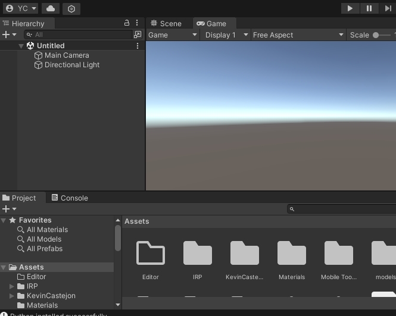
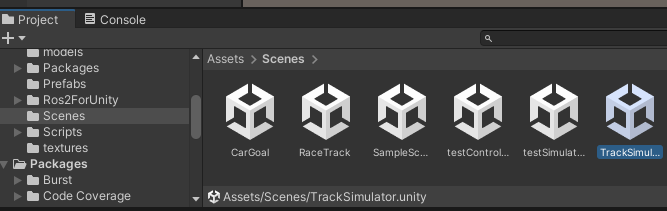

# FSAE-Unity-Simulation Guide

## 0. Prerequisite

At this stage, you should already installed Ubuntu 22.04 and ROS2 humble. 


## 1. Clone Repository
You need both [Autonomous](https://github.com/UOA-FSAE/autonomous.git) and  [FSAE-Unity-Simulation](https://github.com/UOA-FSAE/FSAE-Unity-Simulation.git) repository, under same directory. 

__Don't forget to switch to correct branches !__ 

```
mkdir projects
cd projects/

git clone https://github.com/UOA-FSAE/autonomous.git
git clone https://github.com/UOA-FSAE/FSAE-Unity-Simulation.git

cd autonomous/
git checkout nightly
```
Build all packages at __Root of Autonomous Repo__ with ``` colcon build ``` , It should finish without error.

#### Note
* Use ``` colcon build --parallel-workers Number``` to avoid machine freeze/crash.
* Some packages/msgs we used are not included in default installation of ROS2. Some of them are listed below: 

```
sudo apt install ros-$ROS_DISTRO-foxglove-bridge \
ros-$ROS_DISTRO-foxglove-msgs \
ros-$ROS_DISTRO-ackermann-msgs
```
## 2. Install Softwares
Follow the instructions to install [Unity Hub](https://docs.unity3d.com/hub/manual/InstallHub.html#install-hub-linux) and [Foxglove](https://foxglove.dev/download) on linux. You also need to creat an individual/student account to use them free. 
## 3. Unity Setup
1. Launch Unity Hub just installed and Log in
2. Go to Projects -> Add Projects, then select FSAE-Unity-Simulation folder
3. A recommended Unity Editor version will be suggested, install. 
4. Double click to open the project. You should see a window like this
   
   
5. In the lower left corner, There is a content library. Scroll down and click on __Scenes__. 
   
   
6. Drag the __TrackSimulator__ scene into hierachy in the upper left region. Then right click the __Untitled__ scene and remove it. 
   
   

## 4. Run Unity
1. Click the play button (Little Triangle) in the Unity Editor. Wait for it to fully load.
2. Open a terminal and type: 
 ```
ros2 topic list
```
3. The output should be this: 
 ```
/parameter_events
/race_controller/create
/race_controller/race_stats
/race_controller/reset
/rosout
```
4. Go the root of Autonomus repo, open a terminal and run:
```
. unity_qucik_start.sh
```
5. After several terminal windows pop up, the Simulation should start running. If not, check each of the window for any error messages.
   
#### Note
If the terminal only shows ```/parameter_events``` and ```/rosout```, it means the connection between Unity and ROS2 is not established. 

A likely reason is that the ROS Domain IDs don't match. Unity uses ROS Domain ID __0__. You can open ```.bashrc``` file in home directory and add the following to the end. 

```
export ROS_DOMAIN_ID=0
```
## 5. Visualize Data
1. Open Foxglove, click open connections -> Foxglove Web Socket -> Open.
2. Click on the Panel Tab -> Topics
3. Click to open the eyes of each topic to visualize their data. 
   